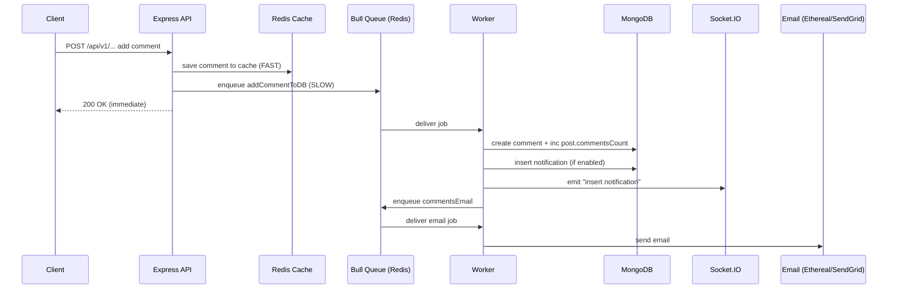

# Chatty Backend — Real‑Time Social Network (Express + TypeScript + MongoDB + Redis + Bull + Socket.IO)

This repository is the **backend** for a **real‑time social networking app**: posts, comments, reactions, followers, chat, image/video upload, and in‑app + email notifications.

It’s built to feel fast in the UI by using a **FAST path** (Socket.IO + Redis cache) and to stay reliable under load by using a **SLOW path** (Bull queues + workers) for heavier operations.

---

## Table of contents
- [What you can build with this](#what-you-can-build-with-this)
- [Tech stack](#tech-stack)
- [Quick start](#quick-start)
- [Environment variables](#environment-variables)
- [Scripts](#scripts)
- [Architecture](#architecture)
- [FAST vs SLOW path](#fast-vs-slow-path)
- [Background jobs with Bull](#background-jobs-with-bull)
- [Real-time with Socket.IO](#real-time-with-socketio)
- [Caching with Redis](#caching-with-redis)
- [Error handling, validation, logging](#error-handling-validation-logging)
- [Graceful shutdown](#graceful-shutdown)
- [Example flows](#example-flows)
- [Project map](#project-map)
- [Monitoring](#monitoring)
- [Deployment overview](#deployment-overview)
- [Known notes](#known-notes--small-caveats)

---

## What you can build with this
- **Auth**: signup/signin, forgot/reset password, change password
- **Posts**: create post (text / image / video), read feed, update, delete
- **Reactions**: like/love/wow/etc + live updates
- **Comments**: add comments + live updates
- **Followers**: follow/unfollow, block/unblock
- **Chat**: direct messaging + rooms + live delivery
- **Notifications**:
  - In‑app notifications (Socket.IO)
  - Email notifications (Ethereal in dev, SendGrid in prod)
- **Uploads**: Cloudinary (image/video)

---

## Tech stack
**Core runtime**
- Node.js + **TypeScript**
- **Express** (HTTP API)

**Data + performance**
- **MongoDB** (Mongoose) → source of truth
- **Redis** →
  - caching layer (fast reads / immediate UI response)
  - Bull queue backend (job persistence + retries)
  - Socket.IO Redis adapter (cross‑instance real-time)

**Async + real-time**
- **Bull** (background jobs)
- **Socket.IO** (real-time events)

**Infra**
- Terraform + AWS (VPC, ALB, ASG, Elasticache, etc.)
- CodeDeploy + CircleCI pipeline
- PM2 cluster mode (multi-process on a host)

---

## Quick start

### 1) Prerequisites
- Node **16+**
- MongoDB running locally (or MongoDB Atlas)
- Redis running locally (or Elasticache)
- Cloudinary account (for upload endpoints)
- Ethereal email credentials for dev OR SendGrid keys for prod

### 2) Install
```bash
npm install
```

### 3) Create `.env`
Copy `.env.development.example` → `.env` and fill the values.

> Local dev note: This project uses **cookie-session** and sets `sameSite: 'none'` for production cross-site cookies.
> For local development you may need to **comment** `sameSite: 'none'` in `src/setupServer.ts` (see “Known notes” below).

### 4) Run dev server
```bash
npm run dev
```

Server default port: **5000**

---

## Environment variables
From `.env.development.example`:

```bash
DATABASE_URL=mongodb://localhost:27017/chattyapp-backend
JWT_TOKEN=your_jwt_secret
NODE_ENV=development

SECRET_KEY_ONE=...
SECRET_KEY_TWO=...

CLIENT_URL=http://localhost:3000

REDIS_HOST=redis://127.0.0.1:6379

CLOUD_NAME=...
CLOUD_API_KEY=...
CLOUD_API_SECRET=...

SENDER_EMAIL=...                # Ethereal dev sender (or your SMTP user)
SENDER_EMAIL_PASSWORD=...       # Ethereal dev password (or your SMTP pass)

SENDGRID_API_KEY=...            # Used in production email sender
SENDGRID_SENDER=...

EC2_URL=http://169.254.169.254/latest/meta-data/instance-id
```

Optional / used by seeding script:
```bash
API_URL=http://localhost:5000/api/v1
```

---

## Scripts
```bash
npm run dev           # nodemon + TS + bunyan logs
npm run build         # compile TS -> build/
npm run start         # PM2 cluster start (-i 5) for production
npm run test          # Jest unit tests
npm run seeds:dev     # seed users via API (requires API_URL)
```

---

## Architecture

### High-level components
```mermaid
flowchart LR
  FE[Frontend (React)] -->|HTTP REST| API[Express API :5000]
  FE -->|Socket.IO| API

  API -->|Read/Write| Mongo[(MongoDB)]
  API -->|Cache reads/writes| Redis[(Redis)]

  API -->|enqueue jobs| Bull[(Bull queues on Redis)]
  Bull -->|process jobs| Workers[Background workers]
  Workers -->|DB writes| Mongo
  Workers -->|emit realtime| SIO[Socket.IO server]
  Workers -->|send email| Email[Email (Ethereal dev / SendGrid prod)]

  API -->|uploads| Cloudinary[(Cloudinary)]
  Workers -->|uploads metadata| Mongo
```

### Scaling view (multiple instances)
Socket.IO is scaled using the **Redis adapter** so events can broadcast across instances.

```mermaid
flowchart TB
  LB[Load Balancer (ALB)] --> A1[Node/Express + Socket.IO Instance A]
  LB --> A2[Node/Express + Socket.IO Instance B]

  A1 <--> Redis[(Redis: cache + queues + socket adapter)]
  A2 <--> Redis

  A1 --> Mongo[(MongoDB)]
  A2 --> Mongo
```

---

## FAST vs SLOW path
**Mental model:**  
- **FAST path** = what the user feels right now (sub-100ms)  
- **SLOW path** = durable work that can happen asynchronously (DB writes, emails, fan-out, etc.)

### FAST path
Typically:
1. Validate request
2. Update cache (Redis) so the UI reads instantly
3. Emit Socket.IO event (real-time update)
4. Respond to client

### SLOW path
1. Producer (controller) enqueues a Bull job
2. Worker consumes and writes to MongoDB
3. Worker may trigger notifications/emails

This pattern is used heavily for comments/reactions/followers/chat/email.

---

## Background jobs with Bull

### The three moving parts
1) **Producer**: controller adds a job  
2) **Queue**: Bull stores jobs in Redis  
3) **Worker**: consumes job + performs DB/email work

### Where Bull lives in the code
- **Base queue**: `src/shared/services/queues/base.queue.ts`
  - creates Bull queues (Redis backend)
  - configures retries: **3 attempts** + **5s fixed backoff**
  - mounts Bull Board UI on `/queues`
- **Feature queues**: `src/shared/services/queues/*.queue.ts`
  - e.g. `post.queue.ts`, `comment.queue.ts`, `email.queue.ts`
- **Workers**: `src/shared/workers/*.worker.ts`
  - actual job execution logic (DB writes / email sending)
- **DB services**: `src/shared/services/db/*.service.ts`
  - Mongoose operations isolated in one layer

### Retry / backoff (built-in reliability)
Every job is created like this (via BaseQueue):
- `attempts: 3`
- `backoff: fixed (5000ms)`

**Why it matters:** temporary failures (network hiccup, Mongo transient error) don’t break user flows.

### Concurrency
Each queue registers processors with concurrency, e.g.
- posts: concurrency `5`
- comments: concurrency `5`
This is “how many jobs in parallel” each instance can run per job type.

---

## Real-time with Socket.IO
HTTP and Socket.IO run on the **same port** (5000) because the server is created once and Socket.IO is attached to it:

- `src/setupServer.ts`
  - `const httpServer = new http.Server(app)`
  - `const io = new Server(httpServer, ...)`

### Socket.IO scaling
- Redis pub/sub adapter is configured in `createSocketIO()`:
  - `@socket.io/redis-adapter`
  - `pubClient` + `subClient` connect to Redis
  - `io.adapter(createAdapter(pubClient, subClient))`

This allows:
- broadcast events across instances
- horizontal scale without losing real-time updates

---

## Caching with Redis
Redis is used for **speed**, not correctness.

**MongoDB is the source of truth.**  
Redis is the “fast layer” used for:
- immediate UI reads
- reducing load on MongoDB
- supporting real-time patterns and job queues

Where cache logic lives:
- `src/shared/services/redis/*.cache.ts`
  - `post.cache.ts`, `comment.cache.ts`, `reaction.cache.ts`, `message.cache.ts`, `user.cache.ts`, etc.

---

## Error handling, validation, logging

### Validation (Joi)
Controllers use a decorator:
- `@joiValidation(schema)`
If validation fails, it throws a typed error that gets handled centrally.

### Central error handling
- Custom error types: `src/shared/globals/helpers/error-handler.ts`
- Global handler: `src/setupServer.ts` → `globalErrorHandler()`

What happens:
- unknown routes → 404 JSON
- `CustomError` → returns `{ message, status, statusCode }`
- all errors are logged via Bunyan

### Async errors
The project uses:
- `express-async-errors`
So thrown errors in async routes are captured by Express without manual try/catch everywhere.

### Logging (Bunyan)
Loggers are created via:
- `config.createLogger(name)`

You’ll see structured logs in:
- `src/app.ts`
- `src/setupServer.ts`
- `src/shared/workers/*.worker.ts`

Local dev:
- logs are piped into bunyan in `npm run dev`

---

## Graceful shutdown
Current implementation (`src/app.ts`) listens for:
- `uncaughtException`
- `SIGTERM`, `SIGINT`

and exits the process.

**Production improvement (recommended):**
To be truly graceful, you typically also:
- close the HTTP server
- close Mongo connection
- close Redis connections

---

## Example flows

### 1) “Add comment” → in‑app + email notification (real flow in code)
This is a great backend project because it shows:
- cache-first response
- async DB work
- notification fan-out
- email via queue

#### Step-by-step
1. Client calls `POST /api/v1/post/comment`
2. API validates request (Joi)
3. API writes comment to **Redis cache** (FAST)
4. API enqueues Bull job `addCommentToDB` (SLOW)
5. API responds immediately
6. Worker writes comment + increments `commentsCount` in Mongo
7. If user has comment notifications enabled:
   - create notification document in Mongo
   - emit Socket.IO event `insert notification`
   - enqueue email job `commentsEmail`

Key files involved:
- Controller: `src/features/comments/controllers/add-comment.ts`
- Queue: `src/shared/services/queues/comment.queue.ts`
- Worker: `src/shared/workers/comment.worker.ts`
- DB + notification/email: `src/shared/services/db/comment.service.ts`



### 2) “Create post” → real-time feed update (real flow in code)
Current behavior:
- emits `add post` via Socket.IO (broadcast)
- writes post to Redis cache
- queues `addPostToDB` to persist in Mongo

Key files:
- Controller: `src/features/post/controllers/create-post.ts`
- Queue/Worker: `src/shared/services/queues/post.queue.ts`, `src/shared/workers/post.worker.ts`

> **Note:** This project currently broadcasts “new post” to connected clients.
> If you want “notify all followers” for new posts, the codebase already has the building blocks (followers + notifications + email queue). See the next section.

### 3) “New post” → notify all followers (how you’d implement using existing building blocks)
This is an **Good Repo** because it shows you can design fan-out safely.

Approach:
1. On post creation:
   - write post to cache and persist via queue (already done)
2. In the **worker** (or a dedicated “fanout” queue):
   - fetch follower list (Mongo or cache)
   - for each follower:
     - create notification doc
     - emit Socket.IO to that follower (room/targeted emit)
     - optionally enqueue email job

Engineering considerations:
- **Fan-out at scale**: don’t do it inline in the request thread.
- **Idempotency**: jobs may run more than once → avoid duplicate notifications (use unique keys).
- **Rate limiting**: avoid email storms (batching/digest emails).
- **Targeted sockets**: use userId→socketId map (already exists) or rooms.

---

## Project map

### Entry points
- `src/app.ts` — bootstraps config + DB + server start
- `src/setupServer.ts` — Express middleware + routes + Socket.IO + Redis adapter
- `src/setupDatabase.ts` — MongoDB + Redis connection sequence
- `src/routes.ts` — mounts all routes + `/queues` dashboard + health endpoints

### Feature modules (same pattern everywhere)
Each feature typically has:
- `controllers/` → HTTP handlers
- `routes/` → endpoint mapping
- `models/` → Mongoose schema
- `interfaces/` → TypeScript types
- `schemes/` → Joi validation schemas
- `controllers/test/` → Jest tests

Features:
- `src/features/auth`
- `src/features/post`
- `src/features/reactions`
- `src/features/comments`
- `src/features/followers`
- `src/features/chat`
- `src/features/notifications`
- `src/features/images`
- `src/features/user`

### Shared infrastructure code
- Redis caches: `src/shared/services/redis/*`
- Queues: `src/shared/services/queues/*`
- Workers: `src/shared/workers/*`
- DB services: `src/shared/services/db/*`
- Sockets: `src/shared/sockets/*`
- Email templates + transport: `src/shared/services/emails/*`

---

## Monitoring
- Bull board dashboard: `GET /queues`
- API metrics: `GET /api-monitoring` (swagger-stats middleware)
- Health checks:
  - `GET /health`
  - `GET /env`
  - `GET /instance` (AWS metadata; meaningful only on EC2)
  - `GET /fibo/:num` (demo endpoint to observe CPU cost + instance info)

> Production note: protect `/queues` and `/api-monitoring` behind auth.

---

## Deployment overview
This repo includes infra and deployment scaffolding:
- `deployment/*` — Terraform to create AWS infra:
  - VPC, subnets, ALB, ASG, Elasticache (Redis), IAM roles, S3, CodeDeploy, etc.
- `appspec.yml` + `scripts/*` — CodeDeploy lifecycle scripts
- `.circleci/config.yml` — CI/CD pipeline

---

## Known notes / small caveats
- Local cookie behavior:
  - `cookie-session` uses `sameSite: 'none'` in `src/setupServer.ts`.
  - For local development, you may need to comment that line and ensure `NODE_ENV=development` so cookies work over HTTP.
- Graceful shutdown is basic (process exit). In production you typically close HTTP/Mongo/Redis explicitly.
- `src/app.ts` listens to `unhandleRejection` (typo). Node’s correct event is `unhandledRejection`.
- `scripts/before_install.sh` checks `DIR` but defines `DIT` (typo).

---

## Why this repo earn a “star” talking points
this repo, emphasize the *engineering decisions*:

1. **Performance:** cache-first reads/writes and fast user feedback.
2. **Reliability:** background jobs with retries/backoff; async email delivery.
3. **Scalability:** Socket.IO Redis adapter + PM2 cluster mode + AWS ALB/ASG architecture.
4. **Clean architecture:** feature modules + service layers + interfaces + validation.
5. **Observability:** Bunyan logs + `/api-monitoring` + `/health`.
6. **Security basics:** Helmet/HPP/CORS/cookie-session.

A strong closing line:
> “This isn’t a prototype — it’s designed for real traffic patterns: real-time UX, async processing, retries, and horizontal scaling.”

